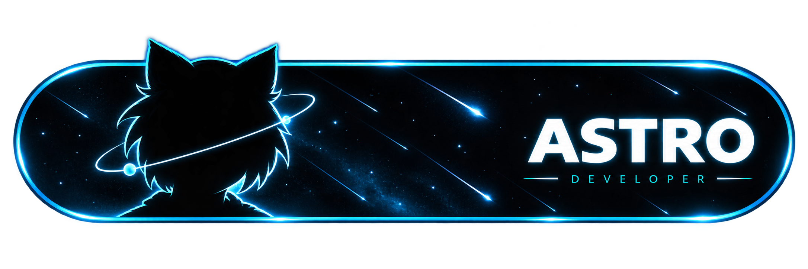
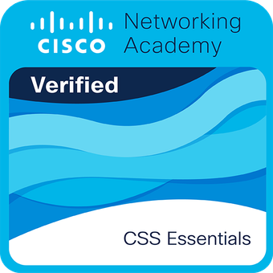

  

   
  
   

---

#  Un poco sobre mí

<table width="100%">
  <tr>
    <td width="60%">
      
 <strong>Soy desarrollador Full Stack</strong> especializado en construir experiencias completas usando Java y Angular.

      
 <strong>Aprendiz constante y curioso por naturaleza.</strong> Me encanta explorar nuevas tecnologías para crear aplicaciones más escalables y eficientes.

      
 <strong>Creo proyectos por vocación.</strong> Me gusta investigar repositorios y probar herramientas nuevas que se vean interesantes para aplicarlas en mis proyectos y resolver problemas del día a día.

      
 <strong>Dato curioso:</strong> Cuando no estoy programando, veo algunos animes, pero sobre todo me encantan los gatos. ¡Eso explica a Neco-Arc trabajando aquí al lado!

    </td>
    <td width="40%" align="center" valign="middle">
      
    </td>
  </tr>
</table>

---

#  Lenguajes y Herramientas

<table width="100%">
  <tr>
    <td valign="top" width="33%">
      <h3 align="center">Frontend</h3>
      

        
        
        
        
        
        
        
      

    </td>
    <td valign="top" width="33%">
      <h3 align="center">Backend & Móvil</h3>
      

        
        
        
      

       
      <h3 align="center">Cloud & Despliegue</h3>
      

        
        
        
      

    </td>
    <td valign="top" width="33%">
      <h3 align="center">Bases de Datos</h3>
      

        
        
        
        
      

       
      <h3 align="center">Herramientas</h3>
      

        
        
        
      

    </td>
  </tr>
</table>

---

#  Algunos Extras

   
  
  
  
  
    

---

#  Mis Estadísticas de GitHub

  
  

  

---

#  Rendimiento de mis Proyectos

  
Análisis en tiempo real de <b><a href="https://astro-web14.netlify.app/" target="_blank">Astro Web</a></b>

    

  

---

#  Mis Certificaciones y Logros

  
  
  
  
  
  

---

#  Contáctame

  
    
  
<i>Mi estado actual en Discord por si quieres hablar...</i>

  
    
 
  <h3><i>¡Gracias por visitar mi perfil! Contribuyendo al contador...</i></h3>
  

  

